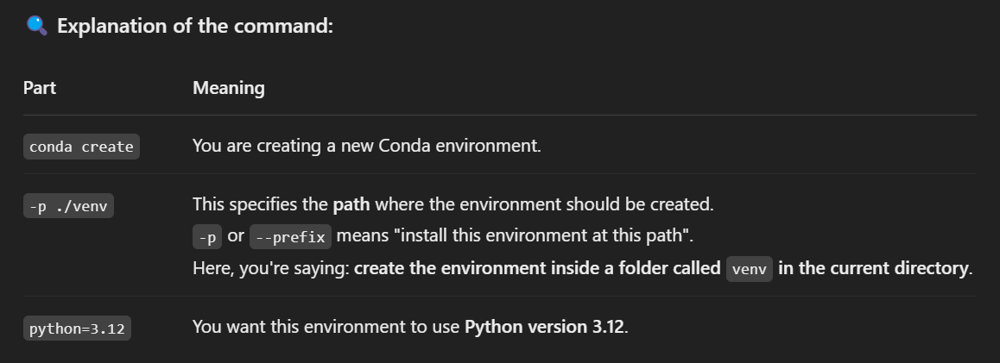
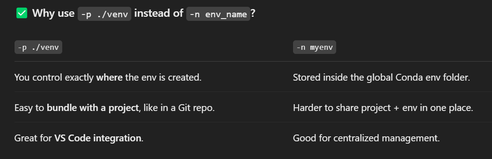

# 🧪 Setting Up Conda Virtual Environment with IPyKernel in VS Code

This guide walks through setting up a **Conda virtual environment** in **VS Code** and configuring it to run Jupyter Notebooks using **IPyKernel**.

---

## ✅ Step-by-Step Instructions

### 1. 📁 Create a Conda Environment (Custom Path)

conda create -p ./venv python=3.12

📁 What happens behind the scenes?
Conda creates a folder named venv in your current directory.

Inside it, it installs a minimal Python 3.12 setup.

This folder will now have bin/, lib/, and other environment files.

✅ Why use -p ./venv instead of -n env_name?

Important: Activation must use the path, not just the name:

conda activate ./venv

2. 🏃‍♂️ Activate the Environment
conda activate ./venv

3. 📦 Install Required Packages
Once activated, install Jupyter and IPyKernel:

pip install --upgrade pip
pip install jupyter ipykernel

4. 🧠 Add the Environment to Jupyter as a Kernel
Register this environment with Jupyter:

You'll now see Python (Conda venv) in the VS Code Jupyter kernel dropdown.

5. 🚀 Open Notebook in VS Code
Open a .ipynb file

Select the kernel: Python (Conda venv)